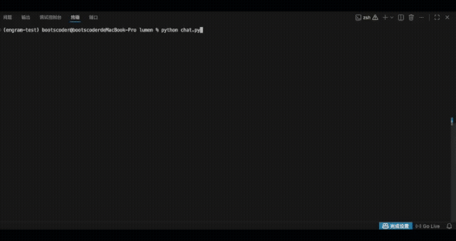
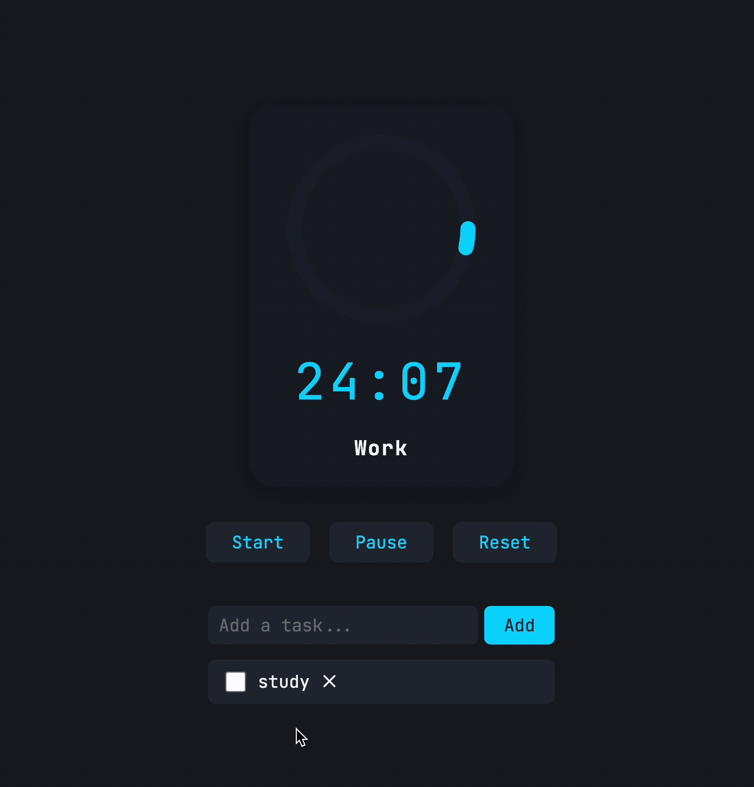

**English** | [中文](README.zh.md)

# Lumen — A Model-Agnostic AI Coding Agent SDK

> **One command turns any LLM into your code architect.**

Lumen is a model-agnostic, production-grade AI coding agent framework (Python 3.11+). Give it an API key and a model name, and you get an AI assistant that can deeply read, write, and analyze code. Works with OpenAI, Anthropic, DeepSeek, Ollama, and any OpenAI-compatible LLM.

<div align="center">
  
</div>

---

## Examples

### Pomodoro timer — generated end-to-end in Review Mode

A pure HTML/CSS/JS Pomodoro timer with an animated SVG countdown ring, auto-switching work/break sessions, a WebAudio beep, and a localStorage-backed task list — built end-to-end by Lumen running `gpt-4.1` under Review Mode (design → pipeline → implementation, gated by `request_approval` between phases).

Source: [examples/pomodoro/](examples/pomodoro/)

<div align="center">
  
</div>

---

## Features at a glance

- **Model-agnostic** — OpenAI / Anthropic / DeepSeek / Ollama / any OpenAI-compatible API, swap with a single line
- **13 built-in tools** — file read/write, code search, shell execution, web search/fetch, LSP code intelligence, sub-agents
- **Extended Thinking** — Anthropic thinking blocks / OpenAI `reasoning_effort` / generic CoT, with adaptive budgeting
- **Prompt Cache** — native Anthropic `cache_control` plus a generic hash-based cache; automatically reduces API cost
- **Structured output** — JSON Schema-enforced output for OpenAI / Anthropic / Gemini, validated via Pydantic
- **Smart permission control** — feature-scored command classifier plus regex dual engine, five risk levels, fully explainable
- **Dynamic session memory** — LLM auto-extracts key facts, TF-IDF retrieval, no vector database required
- **Automatic context compaction** — compresses conversation history as the window fills up, continues seamlessly
- **Skill system** — reusable task templates, defined in JSON/YAML with fuzzy search
- **Persistent retry** — tiered model escalation plus webhook alerts, designed for CI / batch workloads
- **Lifecycle hooks** — pre/post tool hooks for interception, mutation, and remediation
- **Auto-persisted transcripts** — JSONL append-only, crash-safe, resume past sessions with `/resume`
- **Sub-agent system** — parent agents can spawn sub-agents for independent tasks, sync/async modes, linked aborts

---

## Quick start

```bash
# Clone, create an env, and run
git clone https://github.com/boots-coder/lumen.git
cd lumen
conda create -n lumen python=3.11 -y && conda activate lumen
pip install httpx pydantic tiktoken rich prompt_toolkit
# Optional: web search tool, YAML-defined skills
pip install duckduckgo_search pyyaml
python chat.py
```

Or skip the wizard and launch directly:

```bash
# OpenAI
python chat.py --model gpt-4o --api-key sk-proj-...

# Anthropic
python chat.py --model claude-sonnet-4-6 --api-key sk-ant-...

# Local Ollama (no key needed)
python chat.py --model llama3.1 --base-url http://localhost:11434/v1
```

---

## Core capabilities

### Tool suite (invoked autonomously by the model)

| Tool | Purpose |
|------|---------|
| `read_file` | Read file content by line, with `offset` + `limit` pagination |
| `write_file` | Create a new file |
| `edit_file` | Edit an existing file (line-level replacement) |
| `tree` | Render the project directory (auto-filters `node_modules` etc.) |
| `definitions` | Extract every class / function / method from a file with line numbers |
| `glob` | Match file paths by pattern, sorted by modification time |
| `grep` | ripgrep-powered regex search with three output modes |
| `bash` | Execute shell commands |
| `web_search` | DuckDuckGo search (no API key required) |
| `web_fetch` | Fetch a web page and extract readable text |
| `lsp` | LSP code intelligence: go-to-definition / find-references / hover / symbol search |
| `sub_agent` | Spawn a sub-agent for an independent task (requires `enable_subagents()`) |

### Extended Thinking

Three strategies automatically adapt to different models:

| Model family | Mechanism |
|--------------|-----------|
| Anthropic | `thinking: {"type": "enabled", "budget_tokens": N}` |
| OpenAI o-series | `reasoning_effort: "low"/"medium"/"high"` |
| Other models | CoT instructions injected via the system prompt |

The thinking budget adapts to context usage — as the window fills up, it shrinks automatically to leave room for the actual response.

### Structured output

```python
from pydantic import BaseModel

class CodeAnalysis(BaseModel):
    complexity: str
    issues: list[str]
    suggestions: list[str]

result = await agent.query("Analyze this code", schema=CodeAnalysis)
# result is a validated CodeAnalysis instance
```

Supports OpenAI `json_schema` / Anthropic tool-use trick / Gemini / generic JSON mode.

### Command safety classifier

Replaces pure regex with feature scoring — a weighted analysis across four dimensions:

- **Executable** (weight 0.4) — `rm` 0.7, `sudo` 0.9, `ls` 0.0
- **Flags** (weight 0.2) — `-rf` 0.8, `--force` 0.3, `--help` 0.0
- **Argument paths** (weight 0.1) — `/` 0.9, `/etc` 0.4, `./src` 0.0
- **Command composition** (weight 0.3) — `curl | bash` 0.9, subshell 0.3

Context-aware: `rm -f` is much riskier than `-f` on its own.

### Auto-persisted transcripts

Every message is appended to a JSONL file — crash-safe:

```
~/.lumen/projects/{project-path}/{session-id}.jsonl
```

- **Append-only writes** — 100 ms buffer, async flush
- **Fast recovery** — reads metadata from the tail 64 KB, `/resume` restores in one step
- **Session ID** — UUID auto-generated, shown at startup

### Sub-agent system

A parent agent can spawn an isolated sub-agent to parallelize work:

```python
agent.enable_subagents()  # Register the sub_agent tool

# Or use it programmatically
from lumen import SubAgentConfig
result = await agent.subagent_manager.spawn(SubAgentConfig(
    prompt="Audit the security of the auth module",
    description="Security audit",
    run_in_background=True,  # Run asynchronously in the background
))
```

Isolation policy:
- **File cache** — cloned (no cross-contamination)
- **Abort** — parent/child linked (parent abort cascades to child; child abort does not affect parent)
- **Session** — independent conversation history
- **Tools** — inherited or customized

### Dynamic session memory

- Every three turns, key facts (preferences / project / patterns / corrections) are auto-extracted
- TF-IDF keyword retrieval — no vector database required
- Jaccard similarity deduplication, persisted to a JSON file
- Relevant memories are automatically injected on the first turn

### Context management

- **Automatic token counting**: precise per-turn counts with a live progress bar
- **Automatic compaction**: when the window is nearly full, history is compacted into a structured summary
- **Manual compaction `/compact`**: trigger any time, keeping the most recent N messages

### Memory system (ENGRAM.md)

Four priority levels, auto-discovered and loaded:

```
/etc/lumen/ENGRAM.md      # System level (lowest priority)
~/.engram/ENGRAM.md       # User level
./ENGRAM.md               # Project level (team-shared)
./ENGRAM.local.md         # Local private (gitignored)
```

---

## SDK usage

### Basic usage

```python
import asyncio
from lumen import Agent
from lumen.tools import (
    FileReadTool, FileWriteTool, FileEditTool,
    GlobTool, GrepTool, TreeTool, DefinitionsTool, BashTool,
)

async def main():
    agent = Agent(
        api_key="sk-...",
        model="gpt-4o",
        tools=[
            TreeTool(), DefinitionsTool(), FileReadTool(),
            GlobTool(), GrepTool(), BashTool(),
            FileWriteTool(), FileEditTool(),
        ],
        auto_compact=True,
        inject_git_state=True,
    )

    response = await agent.chat("Explain the overall architecture of this project")
    print(response.content)

asyncio.run(main())
```

### Advanced: structured output + Thinking

```python
from lumen import Agent, ThinkingConfig, ThinkingMode

agent = Agent(
    api_key="sk-ant-...",
    model="claude-sonnet-4-6",
    tools=[...],
    thinking=ThinkingConfig(
        enabled=True,
        budget_tokens=10000,
        mode=ThinkingMode.AUTO,
    ),
)

# Structured query
result = await agent.query("List every API endpoint", schema=APIEndpoints)
```

### Advanced: persistent retry (CI scenario)

```python
from lumen import Agent, PersistentRetryConfig

agent = Agent(
    api_key="sk-...",
    model="gpt-4o",
    tools=[...],
    persistent_retry=PersistentRetryConfig(
        enabled=True,
        escalation_threshold=5,
        fallback_models=["gpt-4o-mini", "claude-sonnet-4-6"],
        total_timeout_seconds=3600,
    ),
)
```

---

## Slash commands

| Command | Description |
|---------|-------------|
| `/help` | Show help |
| `/status` | Token usage and session info |
| `/mode code` | Enter deep code-reading mode |
| `/mode general` | Return to general mode |
| `/compact` | Manually compact the context |
| `/reset` | Clear conversation history |
| `/save` | Save the session to a JSON file (transcripts are already auto-persisted) |
| `/load` | Restore a session from a JSON file |
| `/resume` | List recent sessions and pick one to resume |
| `/config` | Reconfigure the model and API key |
| `/quit` | Exit (or Ctrl+D) |

---

## Supported models

| Provider | Example models | Notes |
|----------|----------------|-------|
| **OpenAI** | `gpt-4o`, `gpt-4o-mini`, `o3-mini`, `o1` | Auto-handles API differences for reasoning models |
| **Anthropic** | `claude-sonnet-4-6`, `claude-opus-4-6`, `claude-haiku-4-5` | Native API + thinking blocks |
| **DeepSeek** | `deepseek-chat`, `deepseek-reasoner` | OpenAI-compatible protocol |
| **Ollama** | `llama3.1`, `qwen2.5`, `mistral`, `deepseek-r1` | Run locally, no key needed |
| **Other** | Any OpenAI-compatible API | Custom `base_url` |

---

## Requirements

- Python 3.11+
- `ripgrep` (optional, used by the grep tool; `brew install ripgrep`)
- An API key for OpenAI / Anthropic / DeepSeek, or a local Ollama

Optional dependencies:
- `duckduckgo_search` — required for the web search tool
- `pyyaml` — required for YAML-formatted skill definitions

---

## License

MIT
