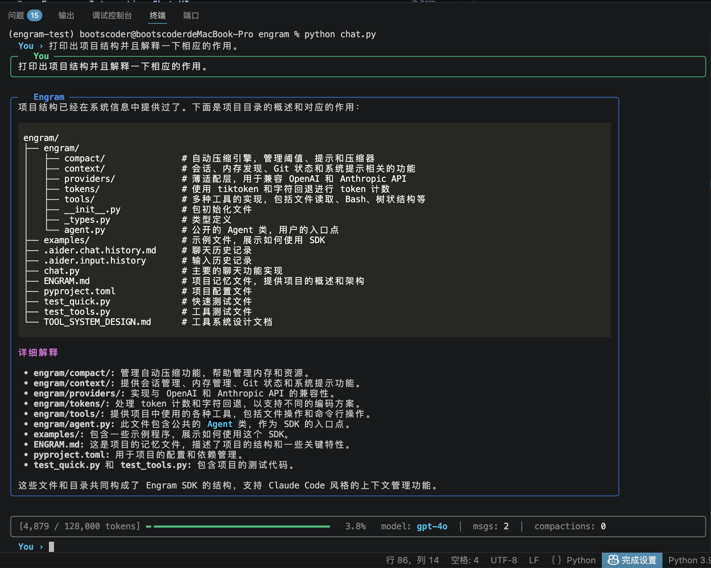
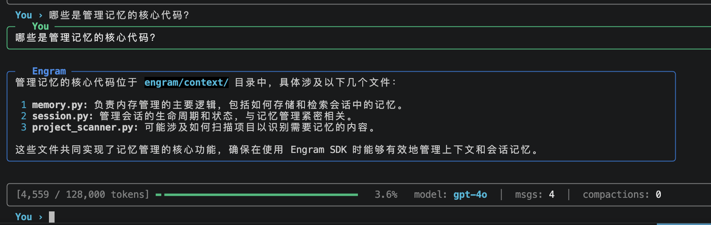
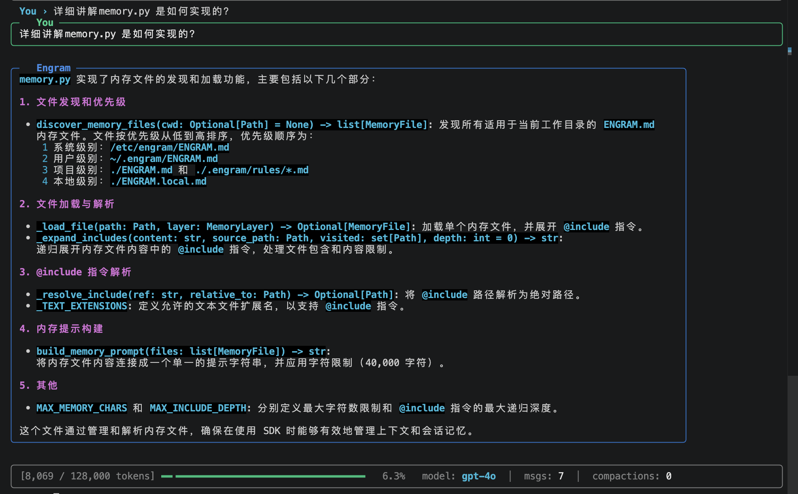
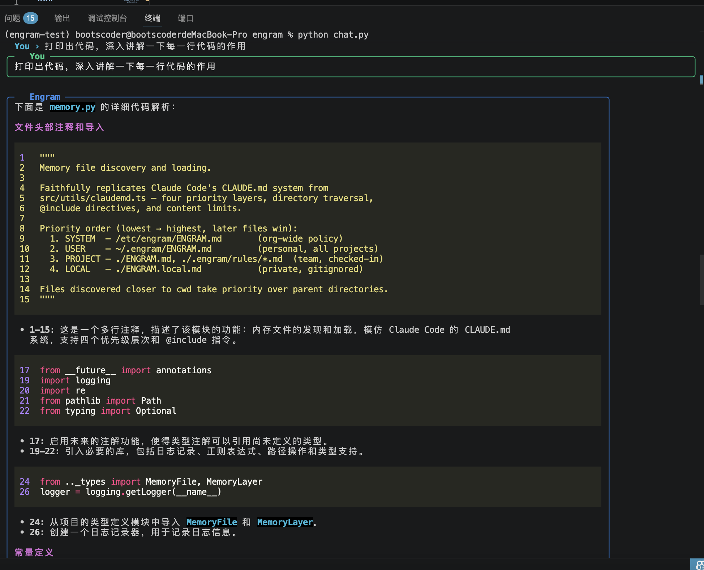
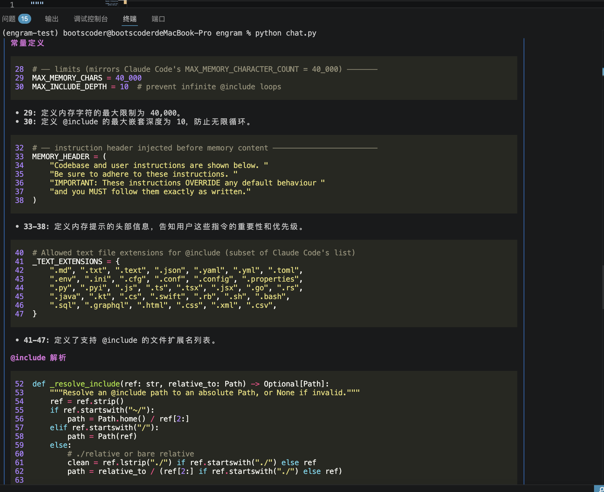
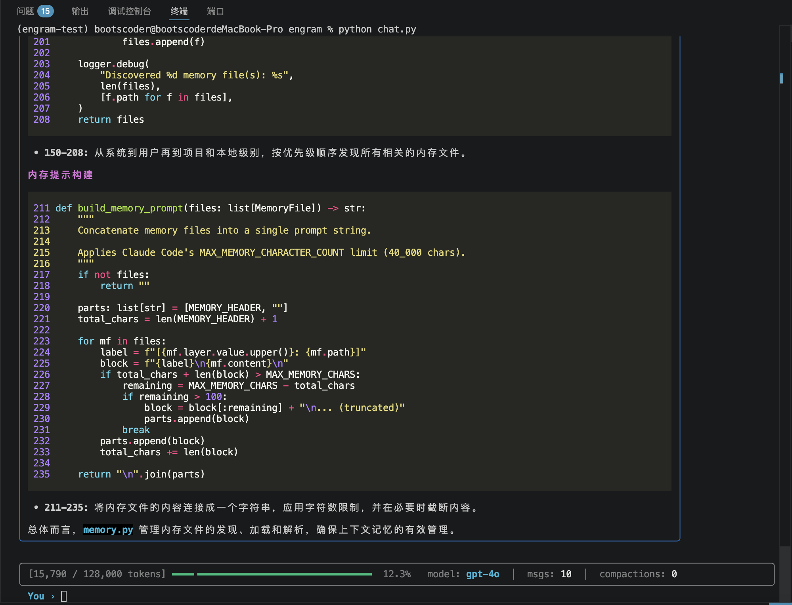
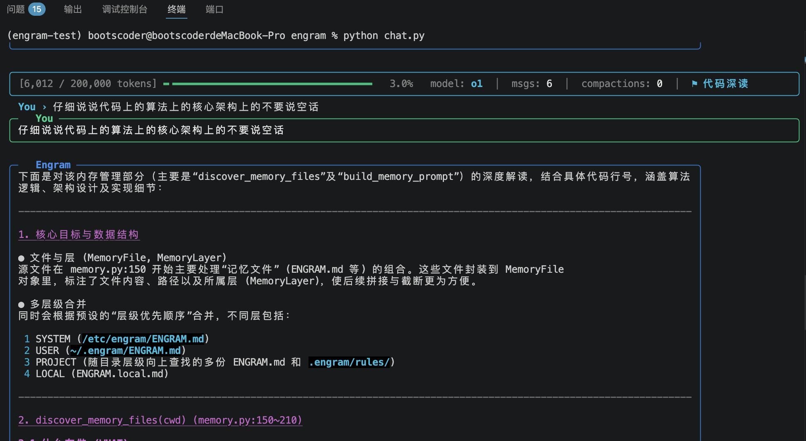
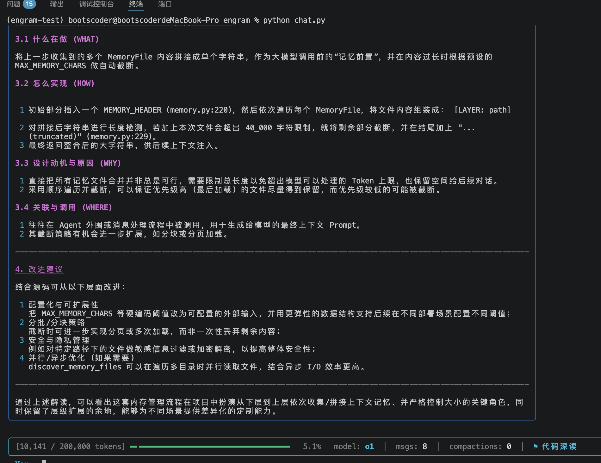

# Lumen — 模型无关的 AI 编码 Agent SDK

> **一行命令，让任意大模型成为你的代码架构师**

Lumen 是一个模型无关、生产级的 AI 编码 Agent 框架（Python 3.11+）。提供 API Key + 模型名，即可获得一个能够深入阅读、编写和分析代码的 AI 助手。支持 OpenAI、Anthropic、DeepSeek、Ollama 等任意兼容 OpenAI 协议的大模型。

<div align="center">
  
</div>

---

## 特性一览

- **模型无关** — OpenAI / Anthropic / DeepSeek / Ollama / 任意 OpenAI 兼容 API，一行切换
- **13 个内置工具** — 文件读写、代码搜索、Shell 执行、Web 搜索/抓取、LSP 代码智能、子代理
- **Extended Thinking** — 支持 Anthropic thinking blocks / OpenAI reasoning_effort / 通用 CoT，预算自适应
- **Prompt Cache** — Anthropic 原生 `cache_control` + 通用 hash-based 缓存，自动降低 API 开销
- **结构化输出** — JSON Schema 强制输出，适配 OpenAI / Anthropic / Gemini，Pydantic 验证
- **智能权限控制** — 特征评分命令分类器 + regex 双引擎，五级风险等级，可解释
- **动态会话记忆** — LLM 自动提取关键事实，TF-IDF 检索，无需向量数据库
- **自动上下文压缩** — 接近窗口上限时自动压缩对话历史，无缝继续
- **技能系统** — 可复用的任务模板，支持 JSON/YAML 定义和模糊搜索
- **持久化重试** — 阶梯式模型升级 + Webhook 告警，适用于 CI/批处理场景
- **生命周期钩子** — pre/post tool hooks，支持拦截、修改和补救
- **对话自动持久化** — JSONL 追加写入，crash-safe，支持 `/resume` 恢复历史会话
- **子代理系统** — 父代理可 spawn 子代理执行独立任务，支持同步/异步模式，abort 联动

---

## 快速开始

```bash
# 克隆项目，创建环境，一键运行
git clone https://github.com/boots-coder/lumen.git
cd lumen
conda create -n lumen python=3.11 -y && conda activate lumen
pip install httpx pydantic pydantic-settings tiktoken anyio rich prompt_toolkit anthropic
python chat.py
```

或者跳过向导直接启动：

```bash
# OpenAI
python chat.py --model gpt-4o --api-key sk-proj-...

# Anthropic
python chat.py --model claude-sonnet-4-6 --api-key sk-ant-...

# 本地 Ollama（无需 Key）
python chat.py --model llama3.1 --base-url http://localhost:11434/v1
```

---

## 项目结构

```
lumen/
├── chat.py                        # 主入口 — 交互式终端 UI
├── lumen/                         # 核心 SDK
│   ├── agent.py                   # Agent 主类（公开 API）
│   ├── _types.py                  # 数据类型定义
│   ├── context/
│   │   ├── session.py             # 会话管理 + Token 计数
│   │   ├── session_memory.py      # 动态会话记忆（TF-IDF 检索）
│   │   ├── transcript.py          # 对话自动持久化（JSONL）
│   │   ├── system_prompt.py       # 系统 Prompt 分层构建
│   │   ├── memory.py              # ENGRAM.md 记忆文件发现与加载
│   │   ├── project_scanner.py     # 项目自动扫描
│   │   └── git_state.py           # Git 状态快照注入
│   ├── compact/
│   │   ├── compactor.py           # 上下文压缩引擎
│   │   ├── auto_compact.py        # 自动压缩触发逻辑
│   │   └── prompt.py              # 压缩 Prompt 模板
│   ├── tools/
│   │   ├── file_read.py           # 文件内容读取
│   │   ├── file_write.py          # 文件创建
│   │   ├── file_edit.py           # 文件编辑（行级替换）
│   │   ├── tree.py                # 目录树工具
│   │   ├── definitions.py         # 代码符号提取
│   │   ├── glob.py                # 文件模式匹配
│   │   ├── grep.py                # ripgrep 内容搜索
│   │   ├── bash.py                # Shell 命令执行
│   │   ├── web_search.py          # Web 搜索（DuckDuckGo）
│   │   ├── web_fetch.py           # 网页抓取 + 文本提取
│   │   ├── lsp.py                 # LSP 代码智能
│   │   └── subagent_tool.py       # 子代理工具
│   ├── providers/
│   │   ├── openai_compat.py       # OpenAI 兼容协议
│   │   ├── anthropic.py           # Anthropic 原生 API
│   │   ├── model_profiles.py      # 模型能力画像（自动适配）
│   │   └── factory.py             # Provider 自动检测
│   ├── services/
│   │   ├── thinking.py            # Extended Thinking 控制
│   │   ├── prompt_cache.py        # Prompt 缓存管理
│   │   ├── structured_output.py   # 结构化输出
│   │   ├── command_classifier.py  # 命令安全分类器
│   │   ├── skills.py              # 技能系统
│   │   ├── persistent_retry.py    # 持久化重试
│   │   ├── permissions.py         # 权限系统
│   │   ├── hooks.py               # 生命周期钩子
│   │   ├── retry.py               # 标准重试（指数退避）
│   │   ├── tool_executor.py       # 并发工具执行
│   │   ├── lsp.py                 # LSP 客户端
│   │   ├── subagent.py            # 子代理管理器
│   │   └── abort.py               # 取消控制
│   └── tokens/
│       └── counter.py             # Token 计数
├── examples/                      # 示例代码
└── tests/                         # 测试
```

---

## 核心功能

### 工具链（AI 自主调用）

| 工具 | 作用 |
|------|------|
| `read_file` | 按行读取文件内容，支持 offset + limit 分页 |
| `write_file` | 创建新文件 |
| `edit_file` | 编辑已有文件（行级替换） |
| `tree` | 展示项目目录结构（自动过滤 node_modules 等） |
| `definitions` | 提取文件中所有类/函数/方法及其行号 |
| `glob` | 按模式匹配文件路径，按修改时间排序 |
| `grep` | ripgrep 正则搜索，三种输出模式 |
| `bash` | 执行 Shell 命令 |
| `web_search` | DuckDuckGo 搜索（无需 API Key） |
| `web_fetch` | 抓取网页并提取可读文本 |
| `lsp` | LSP 代码智能：跳转定义/查找引用/悬停信息/符号搜索 |
| `sub_agent` | 生成子代理执行独立任务（需 `enable_subagents()`） |

### Extended Thinking

三种策略自动适配不同模型：

| 模型家族 | 实现方式 |
|---------|---------|
| Anthropic | `thinking: {"type": "enabled", "budget_tokens": N}` |
| OpenAI o-series | `reasoning_effort: "low"/"medium"/"high"` |
| 其他模型 | 系统 Prompt 注入 CoT 指令 |

思考预算会根据上下文占用率自动调整 — 上下文快满时自动缩减，为实际响应让出空间。

### 结构化输出

```python
from pydantic import BaseModel

class CodeAnalysis(BaseModel):
    complexity: str
    issues: list[str]
    suggestions: list[str]

result = await agent.query("分析这段代码", schema=CodeAnalysis)
# result 是一个验证通过的 CodeAnalysis 实例
```

支持 OpenAI `json_schema` / Anthropic tool-use trick / Gemini / 通用 JSON mode。

### 命令安全分类器

用特征评分替代纯 regex，四维加权分析：

- **可执行文件** (权重 0.4) — `rm` 0.7, `sudo` 0.9, `ls` 0.0
- **命令标志** (权重 0.2) — `-rf` 0.8, `--force` 0.3, `--help` 0.0
- **参数路径** (权重 0.1) — `/` 0.9, `/etc` 0.4, `./src` 0.0
- **命令组合** (权重 0.3) — `curl | bash` 0.9, 子 shell 0.3

上下文感知：`rm -f` 比单独的 `-f` 风险高得多。

### 对话自动持久化

每条消息自动追加到 JSONL 文件，crash-safe：

```
~/.lumen/projects/{project-path}/{session-id}.jsonl
```

- **追加写入** — 100ms 缓冲，异步刷盘
- **快速恢复** — 尾部 64KB 读取 metadata，`/resume` 一键恢复
- **Session ID** — UUID 自动生成，启动时显示

### 子代理系统

父代理可 spawn 独立子代理，实现任务并行化：

```python
agent.enable_subagents()  # 注册 sub_agent 工具

# 或编程式使用
from lumen import SubAgentConfig
result = await agent.subagent_manager.spawn(SubAgentConfig(
    prompt="分析 auth 模块的安全性",
    description="安全审计",
    run_in_background=True,  # 后台异步执行
))
```

隔离策略：
- **File Cache** — 克隆（无交叉污染）
- **Abort** — 父子联动（父 abort → 子 abort，反之不影响）
- **Session** — 独立对话历史
- **Tools** — 继承或自定义

### 动态会话记忆

- 每 3 轮对话自动提取关键事实（偏好/项目/模式/纠正）
- TF-IDF 关键词检索，无需向量数据库
- Jaccard 相似度去重，JSON 文件持久化
- 首轮自动注入相关记忆上下文

### 上下文管理

- **自动 Token 计数**：每轮精确统计，实时显示进度条
- **自动压缩**：接近上限时自动压缩历史为结构化摘要
- **手动压缩 `/compact`**：随时触发，保留最近 N 条消息

### 记忆系统（ENGRAM.md）

四级优先级自动发现与加载：

```
/etc/lumen/ENGRAM.md      # 系统级（最低优先级）
~/.engram/ENGRAM.md       # 用户级
./ENGRAM.md               # 项目级（团队共享）
./ENGRAM.local.md         # 本地私有（gitignore）
```

---

## SDK 用法

### 基础用法

```python
import asyncio
from lumen import Agent
from lumen.tools import (
    FileReadTool, FileWriteTool, FileEditTool,
    GlobTool, GrepTool, TreeTool, DefinitionsTool, BashTool,
)

async def main():
    agent = Agent(
        api_key="sk-...",
        model="gpt-4o",
        tools=[
            TreeTool(), DefinitionsTool(), FileReadTool(),
            GlobTool(), GrepTool(), BashTool(),
            FileWriteTool(), FileEditTool(),
        ],
        auto_compact=True,
        inject_git_state=True,
    )

    response = await agent.chat("解释一下这个项目的整体架构")
    print(response.content)

asyncio.run(main())
```

### 进阶：结构化输出 + Thinking

```python
from lumen import Agent, ThinkingConfig, ThinkingMode

agent = Agent(
    api_key="sk-ant-...",
    model="claude-sonnet-4-6",
    tools=[...],
    thinking=ThinkingConfig(
        enabled=True,
        budget_tokens=10000,
        mode=ThinkingMode.AUTO,
    ),
)

# 结构化查询
result = await agent.query("列出所有 API 端点", schema=APIEndpoints)
```

### 进阶：持久化重试（CI 场景）

```python
from lumen import Agent, PersistentRetryConfig

agent = Agent(
    api_key="sk-...",
    model="gpt-4o",
    tools=[...],
    persistent_retry=PersistentRetryConfig(
        enabled=True,
        escalation_threshold=5,
        fallback_models=["gpt-4o-mini", "claude-sonnet-4-6"],
        total_timeout_seconds=3600,
    ),
)
```

---

## Slash 命令

| 命令 | 说明 |
|------|------|
| `/help` | 显示帮助 |
| `/status` | Token 用量和会话信息 |
| `/mode code` | 开启代码深读模式 |
| `/mode general` | 切回通用模式 |
| `/compact` | 手动压缩上下文 |
| `/reset` | 清空对话历史 |
| `/save` | 保存会话到 JSON 文件（对话已自动持久化） |
| `/load` | 从 JSON 文件恢复会话 |
| `/resume` | 列出最近会话，选择恢复 |
| `/config` | 重新配置模型和 API Key |
| `/quit` | 退出（或 Ctrl+D） |

---

## 支持的模型

| Provider | 示例模型 | 说明 |
|----------|---------|------|
| **OpenAI** | `gpt-4o`, `gpt-4o-mini`, `o3-mini`, `o1` | 自动处理推理模型的 API 差异 |
| **Anthropic** | `claude-sonnet-4-6`, `claude-opus-4-6`, `claude-haiku-4-5` | 原生 API + thinking blocks |
| **DeepSeek** | `deepseek-chat`, `deepseek-reasoner` | OpenAI 兼容协议 |
| **Ollama** | `llama3.1`, `qwen2.5`, `mistral`, `deepseek-r1` | 本地运行，无需 Key |
| **其他** | 任意 OpenAI 兼容 API | 自定义 base_url |

---

## 功能截图

### 启动 & 项目结构阅读



### 核心功能模块精准定位



### 深度讲解具体代码文件



### 逐行代码深度解析







### 代码深读模式 `/mode code`





---

## 环境要求

- Python 3.11+
- `ripgrep`（可选，grep 工具使用；`brew install ripgrep`）
- API Key：OpenAI / Anthropic / DeepSeek，或本地 Ollama

可选依赖：
- `duckduckgo_search` — Web 搜索工具
- `pyyaml` — YAML 格式的技能定义文件

---

## License

MIT
