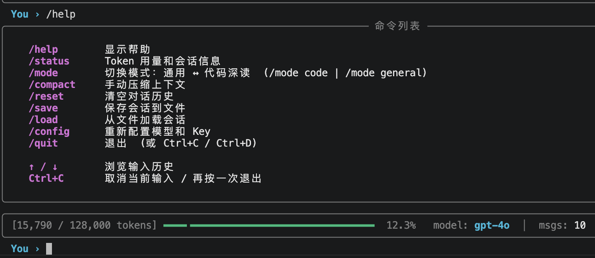
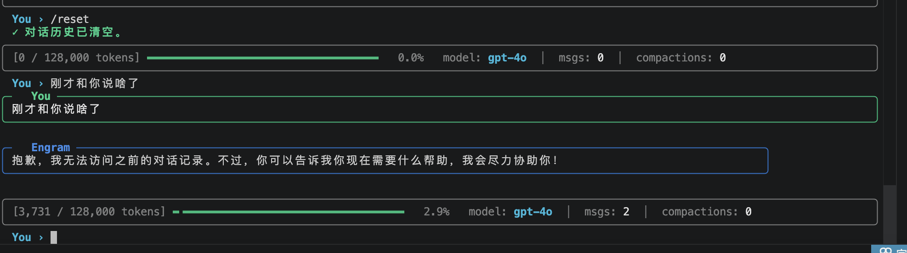

# Lumen — 深度代码阅读 Agent

> **一行命令，让任意大模型成为你的代码架构师**

Lumen 是一个模型无关的深度代码阅读 Agent。提供 API Key + 模型名，即可获得一个能够深入阅读、精准讲解项目源码的 AI 助手。支持 OpenAI、Anthropic、DeepSeek、Ollama 等任意兼容 OpenAI 协议的大模型。

<div align="center">
  
</div>

---

## 一行命令启动

```bash
# 克隆项目，创建环境，一键运行
git clone <repo>
cd lumen
conda create -n lumen python=3.11 -y && conda activate lumen
pip install httpx pydantic pydantic-settings tiktoken anyio rich prompt_toolkit anthropic
python chat.py
```

或者跳过向导直接启动（命令行传参）：

```bash
# OpenAI
python chat.py --model gpt-4o --api-key sk-proj-...

# Anthropic
python chat.py --model claude-sonnet-4-6 --api-key sk-ant-...

# 本地 Ollama（无需 Key）
python chat.py --model llama3.1 --base-url http://localhost:11434/v1
```

---

## 项目结构

```
engram/
├── chat.py                   # 主入口 — 交互式终端 UI
├── lumen/                    # 核心 SDK
│   ├── agent.py              # Agent 主类（公开 API）
│   ├── _types.py             # 数据类型定义
│   ├── context/
│   │   ├── session.py        # 会话管理 + Token 计数
│   │   ├── system_prompt.py  # 系统 Prompt 分层构建
│   │   ├── memory.py         # ENGRAM.md 记忆文件发现与加载
│   │   ├── project_scanner.py# 项目自动扫描（启动时注入上下文）
│   │   └── git_state.py      # Git 状态快照注入
│   ├── compact/
│   │   ├── compactor.py      # 上下文压缩引擎
│   │   ├── auto_compact.py   # 自动压缩触发逻辑
│   │   └── prompt.py         # 压缩 Prompt 模板
│   ├── tools/
│   │   ├── tree.py           # 目录树工具
│   │   ├── definitions.py    # 代码符号提取（类/函数/方法）
│   │   ├── file_read.py      # 文件内容读取
│   │   ├── glob.py           # 文件模式匹配
│   │   ├── grep.py           # ripgrep 内容搜索
│   │   └── bash.py           # Shell 命令执行
│   ├── providers/
│   │   ├── openai_compat.py  # OpenAI 兼容协议（GPT / DeepSeek / Ollama 等）
│   │   └── anthropic.py      # Anthropic 原生 API
│   └── tokens/
│       └── counter.py        # Token 计数（tiktoken + 字符估算回退）
├── pyproject.toml
└── ENGRAM.md                 # 项目记忆文件（可自定义）
```

---

## 功能截图

### 1. 启动 & 项目结构阅读

启动后，AI 会自动扫描当前项目目录并注入上下文。直接提问即可获得项目结构的详细解读：


---

### 2. 核心功能模块精准定位

AI 能够精准定位项目核心模块，说明每个模块的职责和位置：


---

### 3. 深度讲解具体代码文件

对单个文件进行完整讲解，覆盖 WHAT / HOW / WHY / WHERE 四个维度：


---

### 4. 逐行代码深度解析

可以要求 AI 逐行解析代码，包括注释、设计决策、边界条件：


---

### 5. 帮助命令 `/help`

内置完整的 Slash 命令系统：



---

### 6. 代码深读模式 `/mode code`

开启后，AI 会主动使用工具读取代码再回答，严格遵循架构优先、逐层展开的阅读方式：


---

### 7. 记忆清理 `/reset`

一键清空对话历史，重新开始：



---

## 核心功能

### 上下文管理
- **自动 Token 计数**：每轮对话后精确统计 Token 使用量，实时显示进度条
- **自动压缩（Auto Compact）**：接近上下文窗口上限时，自动将对话历史压缩为结构化摘要，无缝继续对话
- **手动压缩 `/compact`**：随时触发，保留最近 N 条消息原文

### 代码阅读工具链（AI 自主调用）

| 工具 | 作用 |
|------|------|
| `tree` | 展示项目目录结构（自动过滤 node_modules / __pycache__ 等） |
| `definitions` | 提取文件中所有类 / 函数 / 方法及其行号 |
| `read_file` | 按行读取文件内容，支持 offset + limit 分页 |
| `glob` | 按模式匹配文件路径，按修改时间排序 |
| `grep` | ripgrep 驱动的正则搜索，支持 `files_with_matches` / `content` / `count` 三种模式 |
| `bash` | 执行 Shell 命令（git log、pytest 等） |

### 记忆系统（ENGRAM.md）
四级优先级的记忆文件自动发现与加载：
```
/etc/lumen/ENGRAM.md      # 系统级（最低优先级）
~/.engram/ENGRAM.md       # 用户级
./ENGRAM.md               # 项目级（团队共享）
./ENGRAM.local.md         # 本地私有（gitignore）
```

### 代码深读模式
`/mode code` 开启后，AI 会：
- 永远先用工具读代码，再回答（不猜测、不幻觉）
- 每次解释覆盖 **WHAT / HOW / WHY / WHERE** 四个维度
- 自动追踪调用链，标注 `file:line`
- 先讲架构全貌，再讲实现细节

---

## Slash 命令

| 命令 | 说明 |
|------|------|
| `/help` | 显示帮助 |
| `/status` | Token 用量和会话信息 |
| `/mode code` | 开启代码深读模式 |
| `/mode general` | 切回通用模式 |
| `/compact` | 手动压缩上下文 |
| `/reset` | 清空对话历史 |
| `/save` | 保存会话到 JSON 文件 |
| `/load` | 从 JSON 文件恢复会话 |
| `/config` | 重新配置模型和 API Key |
| `/quit` | 退出（或 Ctrl+D） |

---

## 支持的模型

| Provider | 示例模型 | 说明 |
|----------|---------|------|
| **OpenAI** | `gpt-4o`, `gpt-4o-mini`, `o3-mini`, `o1` | 自动处理推理模型的 API 差异 |
| **Anthropic** | `claude-sonnet-4-6`, `claude-opus-4-6`, `claude-haiku-4-5` | 原生 API |
| **DeepSeek** | `deepseek-chat`, `deepseek-reasoner` | OpenAI 兼容协议 |
| **Ollama** | `llama3.1`, `qwen2.5`, `mistral`, `deepseek-r1` | 本地，无需 Key |
| **其他** | 任意 OpenAI 兼容 API | 自定义 base_url |

---

## SDK 用法

```python
import asyncio
from lumen import Agent
from lumen.tools import FileReadTool, GlobTool, GrepTool, TreeTool, DefinitionsTool, BashTool

async def main():
    agent = Agent(
        api_key="sk-...",
        model="gpt-4o",
        tools=[TreeTool(), DefinitionsTool(), FileReadTool(), GlobTool(), GrepTool(), BashTool()],
        auto_compact=True,
        inject_git_state=True,
    )

    # 开启代码深读模式
    agent.enable_code_reading_mode()

    # 提问
    response = await agent.chat("解释一下这个项目的整体架构")
    print(response.content)

asyncio.run(main())
```

---

## 自定义记忆文件

在项目根目录创建 `ENGRAM.md`，写入你希望 AI 始终记住的上下文：

```markdown
# 项目背景
这是一个 FastAPI 后端项目，使用 PostgreSQL + Redis。

# 代码规范
- 所有 API 返回值使用 Pydantic 模型
- 数据库操作使用 async SQLAlchemy
- 测试使用 pytest-asyncio

# 重要约定
- 不要修改 legacy/ 目录下的文件
- 所有新功能需要写单元测试
```

---

## 环境要求

- Python 3.11+
- `ripgrep`（可选，grep 工具使用；`brew install ripgrep`）
- API Key：OpenAI / Anthropic / DeepSeek，或本地 Ollama

---

## License

MIT
